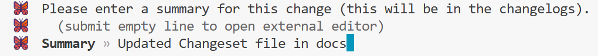
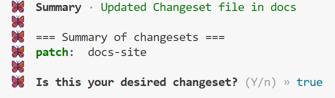

### Changeset required (most PRs)
This repo uses Changesets for versioning and changelog.

Add a changeset when your change affects the published package.

You need to run this command in order to create .changeset folder for the first time

```bash
npx changeset init
```


**Before opening a PR, run once**:
```bash
npx changeset 
```

or

```bash
npx changeset add
```

There is no difference between these commands.

After that press 'Enter' and add the summary of the changed files starting with a capital letter

Example



Then you will see this prompt:



If this is your desired changeset, press 'Enter'

It creates a small file in .changeset/ that describes what changed and whether it’s a patch/minor/major bump.
This keeps releases consistent and avoids “forgot to bump version” chaos.

No changeset needed for: docs-only, internal refactors with zero user impact (unless you want it in the changelog).


For more info on changeset, [look here](https://www.npmjs.com/package/@changesets/cli)